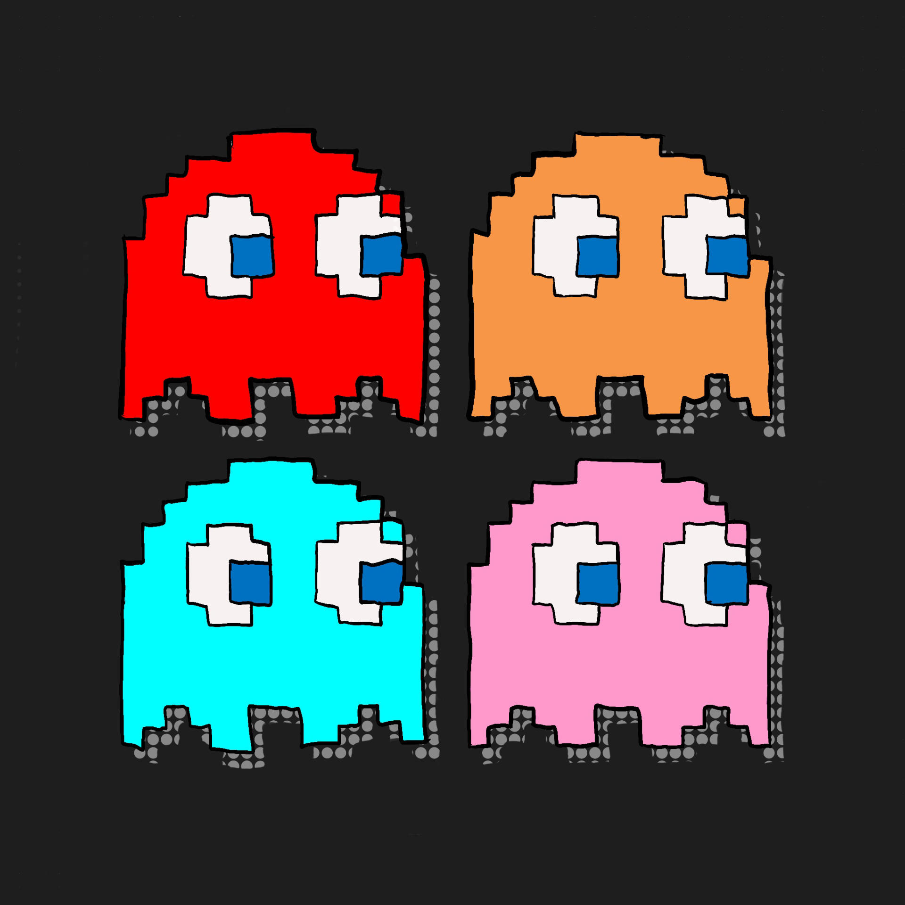

# Pac-Man

<p align="center">
  
</p>

A classic Pac-Man game built with Python and Pygame.

## Setup

```
python -m venv venv
source venv/bin/activate
pip install -r requirements.txt
```

## Play

```
python main.py
```

## Controls

| Key | Action |
|-----|--------|
| Arrow keys / WASD | Move |
| Enter / Space | Start / Continue |
| Escape | Quit |

## Rules

- Eat all dots to clear the level
- Eat power pellets to turn ghosts blue and eat them
- Avoid ghosts — you have 3 lives
- Bonus fruit appears after 70 and 170 dots

## License

MIT
