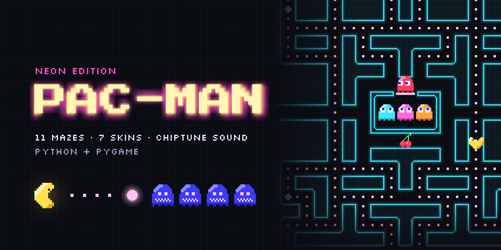
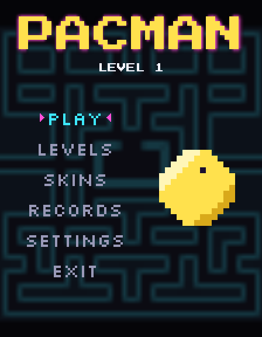
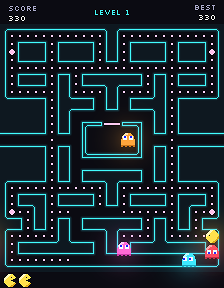
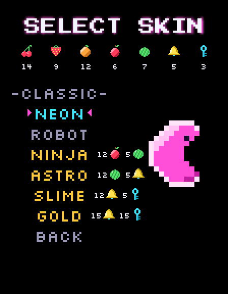

<p align="center">
  
</p>

A neon-styled Pac-Man game built with Python and Pygame.

<p align="center">
  
  
  
</p>

## Features

- 11 mazes — the classic arcade layout plus 10 generated ones — with level select; beat a level to unlock the next
- 7 original Pac-Man skins — Classic, Neon, Robot, Ninja, Astro, Slime, Gold — bought with the fruit you eat
- Top-5 records per level
- Settings: sound on/off, volume, difficulty (Child / Normal / Hardcore), FUN mode (remixed sound variants)
- Pause menu, cheat codes, progress saved to `storage.json`

## Setup

Requires Python 3.10+.

```
python -m venv venv
source venv/bin/activate
pip install -r requirements.txt
```

## Play

```
python main.py
```

## Controls

| Key | Action |
|-----|--------|
| Arrow keys / WASD | Move / navigate menus |
| Enter / Space | Select |
| Escape | Pause / back (on the title screen: new maze colour) |
| Ctrl+Q | Quit |

## Cheat codes

- In game: **god** — win the level, **kill** — lose, **aezakmi** — extra life
- In menu: **pycman** — unlock all levels and skins (progress is not saved afterwards)

## Assets

Levels, art and audio are all generated from source, so they can be tweaked and rebuilt:

| Asset | Source | Rebuild |
|-------|--------|---------|
| Levels 02–11 (`assets/levels/*.txt`) | `tools/generate_levels.py` (level 01 is the hand-made classic maze) | `python tools/generate_levels.py` |
| Sprites, maze glow layers, icon | `design/pixelkit.js` | `node tools/build_assets.mjs` (after regenerating levels) |
| Sounds | `tools/synth_sounds.py` | `python tools/synth_sounds.py` |
| Fonts | [Press Start 2P](https://fonts.google.com/specimen/Press+Start+2P), [Silkscreen](https://fonts.google.com/specimen/Silkscreen) (OFL) | — |

`design/pixelkit.js` mirrors the **Pac-Man Neon Asset Kit** project in Claude Design, whose
preview page renders every sprite, animation and a tinted maze live. Edit it there (or here),
keep both copies in sync, then rebuild — the tests fail if the committed PNGs or levels
drift from their generators.

Level files are plain text, 31 rows × 28 columns: `#` wall, `.` pellet, `o` power pellet,
`=` open floor, `-` ghost-house door, `_` house floor, and two-cell spawn markers
`PP` (Pac-Man), `BB` (Blinky), `pp`/`ii`/`cc` (Pinky/Inky/Clyde), `FF` (fruit).

## Code layout

| Module | Role |
|--------|------|
| `pacman/app.py` | Main loop and scene stack |
| `pacman/scenes/` | Title, play, pause/results, levels, skins, records, settings |
| `pacman/actors.py` | Pac-Man and the four ghost personalities |
| `pacman/level.py` | Level files and grid geometry |
| `pacman/art.py`, `audio.py`, `save.py`, `ui.py` | Sprites & skins, sound, progress, menus/text |

## Tests

```
pip install -r requirements-dev.txt
pytest
```

## License

MIT — see [LICENSE](LICENSE). The bundled fonts are under the SIL Open Font License 1.1.
